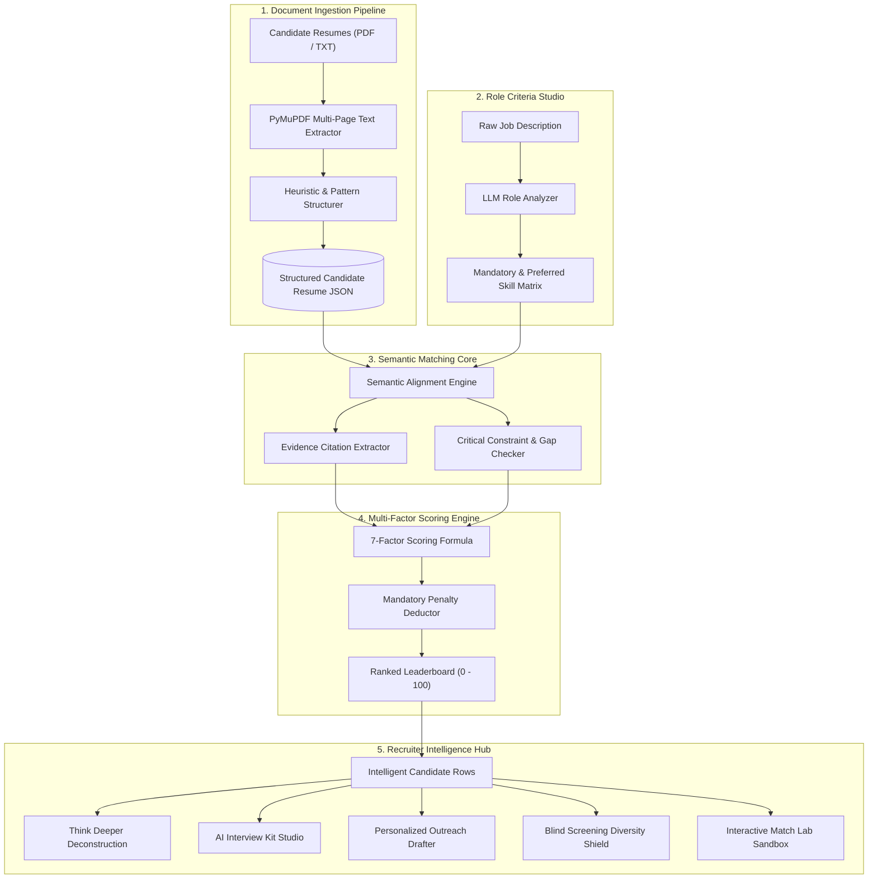

# ⚡ UNTHINKABLE — Smart Resume Intelligence

<div align="center">

```
   __  ___   _________  ____  ____ _____ _____    ____  __    ______
  / / / / | / /_  __/ / / / / / / // / // // / /   / __ )/ /   / ____/
 / / / /  |/ / / / / /_/ / / / / // /_  //_  / /   / __  / /   / __/   
/ /_/ / /|  / / / / __  / /_/ /__  __/_  _// /___/ /_/ / /___/ /___   
\____/_/ |_/ /_/ /_/ /_/\____/  /_/   /_/ /_____/_____/_____/_____/   
```

### *Think beyond the obvious.*

**An intelligent, dark-first, precision AI recruitment platform built for modern engineering talent teams.**

**Created & Engineered by:**  
🎓 **Kurapati SriHarsha Vardhan**  
**Registration No:** `23BCE8747` | **Institution:** **VIT-AP University**

---

[](https://www.python.org/downloads/)
[](https://fastapi.tiangolo.com)
[](https://reactjs.org/)
[](https://www.typescriptlang.org/)
[](https://tailwindcss.com/)
[](docker-compose.yml)
[](backend/tests/)
[](LICENSE)

</div>

---

## 📑 Table of Contents

- [Developer & Academic Attribution](#-developer--academic-attribution)
- [Overview & Philosophy](#-overview--philosophy)
- [System Architecture & End-to-End Workflow](#-system-architecture--end-to-end-workflow)
- [Feature Deep Dive](#-feature-deep-dive)
  - [1. ⚡ Bulk Resume Ingestion & PyMuPDF Multi-Page Extraction](#1--bulk-resume-ingestion--pymupdf-multi-page-extraction)
  - [2. ⚡ AI Semantic Match Engine & Cited Evidence Verification](#2--ai-semantic-match-engine--cited-evidence-verification)
  - [3. ⚡ Transparent 7-Factor Deterministic Scoring Engine](#3--transparent-7-factor-deterministic-scoring-engine)
  - [4. ⚡ "Think Deeper" Signature Candidate Deconstruction](#4--think-deeper-signature-candidate-deconstruction)
  - [5. 🧪 Interactive Match Lab (Real-Time Sandbox)](#5--interactive-match-lab-real-time-sandbox)
  - [6. 🎯 AI Interview Kit & Question Studio](#6--ai-interview-kit--question-studio)
  - [7. ✍️ AI Candidate Outreach Generator](#7--ai-candidate-outreach-generator)
  - [8. 🛡️ Bias-Free Blind Screening Shield Mode](#8--bias-free-blind-screening-shield-mode)
  - [9. ⌨️ Global Command Palette (`⌘K` / `Ctrl+K`)](#9--global-command-palette-k--ctrlk)
  - [10. 📊 Side-by-Side Dimension Matrix & Competency Radar](#10--side-by-side-dimension-matrix--competency-radar)
  - [11. 📥 1-Click Leaderboard CSV Export](#11--1-click-leaderboard-csv-export)
- [Mathematical Scoring Model](#-mathematical-scoring-model)
- [Product Previews & Screenshots](#-product-previews--screenshots)
- [Local Development Setup](#-local-development-setup)
- [🚀 End-to-End Production Deployment Guide](#-end-to-end-production-deployment-guide)
  - [Method 1: Docker Compose (VPS / EC2 / DigitalOcean)](#method-1-docker-compose-vps--ec2--digitalocean)
  - [Method 2: Render.com (1-Click Cloud Blueprint)](#method-2-rendercom-1-click-cloud-blueprint)
  - [Method 3: Railway.app Deployment](#method-3-railwayapp-deployment)
  - [Method 4: Vercel (Frontend) + Fly.io/Render (Backend)](#method-4-vercel-frontend--flyiorender-backend)
  - [Method 5: Traditional Linux Server (Systemd + Nginx)](#method-5-traditional-linux-server-systemd--nginx)
- [📡 API Reference](#-api-reference)
- [🧪 Automated Testing Suite](#-automated-testing-suite)
- [⚖️ Responsible AI Notice](#-responsible-ai-notice)

---

## 🎓 Developer & Academic Attribution

| Attribute | Details |
| :--- | :--- |
| **Developer Name** | **Kurapati SriHarsha Vardhan** |
| **Registration Number** | **23BCE8747** |
| **University / Institute** | **VIT-AP University** |
| **Project** | Smart Resume Screener (UNTHINKABLE Intelligence Platform) |
| **Core Stack** | FastAPI, React 18, TypeScript, PyMuPDF, Tailwind CSS, SQLite, Docker |

---

## 🔮 Overview & Philosophy

Traditional Applicant Tracking Systems (ATS) rely on brittle keyword string matching—rejecting exceptional engineers because of minor phrasing differences or rewarding keyword-stuffed resumes.

**UNTHINKABLE** represents a modern paradigm shift:
- **Intelligent**: Understands semantic equivalents (e.g. recognizing that building low-latency inference in FastAPI directly relates to production backend requirements).
- **Explainable & Verifiable**: Every match score links directly to verifiable cited quotes from candidate resumes.
- **Deterministic**: Scores are computed through a transparent mathematical rubric with explicit penalties for missing mandatory constraints.
- **Developer & Recruiter Centric**: Designed with a sleek, dark-first interface, keyboard shortcuts, and clean architecture.

---

## 🏛 System Architecture & End-to-End Workflow

### Visual Architecture Flowchart



### ASCII Architecture Overview

```
+---------------------------------------------------------------------------------------+
|                                    UNTHINKABLE PLATFORM                               |
+---------------------------------------------------------------------------------------+
|                                                                                       |
|  [ RESUME UPLOAD ] ---> ( PyMuPDF Text Extractor ) ---> [ Structured Candidate JSON ]  |
|                                                                 |                     |
|  [ JOB DESCRIPTION ] -> ( LLM Requirement Analyzer ) -> [ Role Criteria Schema ]      |
|                                                                 |                     |
|                                                                 v                     |
|                                                    ( Semantic Match Engine )          |
|                                                                 |                     |
|                                       +-------------------------+------------------+  |
|                                       |                                            |  |
|                                       v                                            v  |
|                         [ Cited Resume Evidence ]                    [ Critical Gaps ]|
|                                       |                                            |  |
|                                       +-------------------------+------------------+  |
|                                                                 |                     |
|                                                                 v                     |
|                                                ( 7-Factor Scoring + Penalties )       |
|                                                                 |                     |
|        +--------------------------------------------------------+-------------------+ |
|        |                        |                       |                           | |
|        v                        v                       v                           v |
|  [ LEADERBOARD ]       [ THINK DEEPER ]        [ INTERVIEW KIT ]          [ MATCH LAB ]
+---------------------------------------------------------------------------------------+
```

---

## 🚀 Feature Deep Dive

### 1. ⚡ Bulk Resume Ingestion & PyMuPDF Multi-Page Extraction
- Multi-file drag-and-drop supporting up to 10MB per document in PDF and TXT formats.
- High-fidelity text extraction via PyMuPDF (`fitz`) with clean fallback sanitization.
- Extracts candidate name, email, Indian phone formats, locations, total experience, categorized skills, education history, and project summaries into structured JSON schemas.

### 2. ⚡ AI Semantic Match Engine & Cited Evidence Verification
- Evaluates candidate qualifications against job requirements using semantic synonym mapping (e.g. *PostgreSQL ↔ Relational DBs*, *PyTorch ↔ Deep Learning*).
- Extracts verifiable cited quotes from the resume for every matched requirement.
- Visually categorizes findings into `✓ MATCHED`, `◐ PARTIAL`, and `× MISSING`.

### 3. ⚡ Transparent 7-Factor Deterministic Scoring Engine
- Computes match scores across 7 normalized dimensions:
  1. **Technical Skills** (35%)
  2. **Verified Experience** (20%)
  3. **Role Responsibilities** (15%)
  4. **Projects & Practical Impact** (10%)
  5. **Education & Degree Alignment** (5%)
  6. **Preferred Qualifications** (10%)
  7. **Soft Skills & Communication** (5%)
- Automatic penalty deduction applied when mandatory constraints (e.g. minimum experience threshold or core required frameworks) are not met.

### 4. ⚡ "Think Deeper" Signature Candidate Deconstruction
- Goes beyond keyword matching to uncover:
  - ✦ **Hidden Strengths**: Architectural intuition and adjacent engineering skills not explicitly demanded in the JD.
  - ✦ **Transferable Experience**: Relevant domain experience that translates into the target role.
  - ✦ **Verification Needed**: Potential ambiguities to probe during technical rounds.
  - ✦ **Interview Focus Questions**: 3–5 tailored technical interview questions designed specifically for the candidate.

### 5. 🧪 Interactive Match Lab (Real-Time Sandbox)
- Instant live playground where recruiters can test arbitrary resume text on the left and target job criteria on the right.
- Sub-50ms live scoring gauge, category breakdown, matched skills, and evidence citations.

### 6. 🎯 AI Interview Kit & Question Studio
- 1-click generation of 4 specialized interview categories tailored to candidate strengths and gaps:
  - *Technical Architecture & Depth*
  - *Data & Feature Engineering*
  - *Gap & Growth Verification*
  - *System Reliability & Incident Response*
- Complete with *"✓ Look For"* criteria, *"✗ Red Flags"*, senior/mid/junior rubrics, and 1-click clipboard copy.

### 7. ✍️ AI Candidate Outreach Generator
- 1-click generation of personalized recruiter communications citing specific projects from the candidate's resume:
  - 📩 *Interview Invitation*
  - ⏱ *Application In-Review Update*
  - 🤝 *Constructive Skill Growth Feedback*

### 8. 🛡️ Bias-Free Blind Screening Shield Mode
- 1-click global toggle (`Blind Mode: ON`) that anonymizes candidate names (`Candidate #01`), hides contact details (email, phone, address), and focuses the review team purely on verified skills and competency.

### 9. ⌨️ Global Command Palette (`⌘K` / `Ctrl+K`)
- Press `⌘K` or `Ctrl+K` from any screen to search across candidates, navigate pages, toggle Blind Mode, or trigger workspace actions.

### 10. 📊 Side-by-Side Dimension Matrix & Competency Radar
- Compare 2 to 4 candidates side-by-side with an interactive Recharts dark-mode Competency Radar chart overlay and `★ BEST OVERALL FIT` candidate spotlight badge.

### 11. 📥 1-Click Leaderboard CSV Export
- Download complete screening sessions as CSV files (`/api/screening/sessions/{id}/export-csv`) with ranks, category scores, matched/missing skills, and recruiter notes.

---

## 🧮 Mathematical Scoring Model

The final score $S \in [0, 100]$ is computed deterministically:

$$S = \max\left(0, \sum_{i=1}^{7} W_i \cdot R_i - P_{\text{mandatory}}\right)$$

Where:
- $W_i$: Normalized category weights:
  $$\sum_{i=1}^{7} W_i = 100$$
- $R_i$: Category percentage alignment ($0.0 - 100.0$)
- $P_{\text{mandatory}}$: Explicit penalty deduction:
  - Missing mandatory technical framework: $-10$ to $-20$ points
  - Experience below threshold: $-12$ points

### Recommendation Tiers:
| Score Range | Tier Classification | Visual Indicator |
| :--- | :--- | :--- |
| **90 – 100** | **EXCELLENT MATCH** | `#00f2c3` (Electric Cyan) |
| **75 – 89** | **STRONG MATCH** | `#14b8a6` (Teal) |
| **60 – 74** | **MODERATE MATCH** | `#38bdf8` (Sky Blue) |
| **40 – 59** | **WEAK MATCH** | `#f59e0b` (Amber) |
| **0 – 39** | **POOR MATCH** | `#f43f5e` (Rose) |

---

## 📸 Product Previews & Screenshots

### Dashboard Overview & Live Pipeline


### Intelligent Candidate Leaderboard


### Candidate Intelligence Report & "Think Deeper"


### Multi-Candidate Dimension Matrix & Radar


---

## 💻 Local Development Setup

### Prerequisites
- **Python 3.10+**
- **Node.js 18+** & **npm**

### 1. Clone the Repository
```bash
git clone https://github.com/MrAlhm/ResumeScreener.git
cd ResumeScreener
```

### 2. Backend Setup
```bash
cd backend
python -m pip install -r requirements.txt
python -m uvicorn app.main:app --host 127.0.0.1 --port 8000 --reload
```
Interactive Swagger API documentation will be live at: [http://127.0.0.1:8000/docs](http://127.0.0.1:8000/docs)

### 3. Frontend Setup
```bash
cd ../frontend
npm install
npm run dev
```
Open your browser at: [http://localhost:5173](http://localhost:5173)

---

## 🚀 End-to-End Production Deployment Guide

---

### Method 1: Docker Compose (VPS / EC2 / DigitalOcean)
*Recommended for single-server production deployments.*

1. **SSH into your server:**
   ```bash
   ssh user@your-server-ip
   ```

2. **Clone the repository:**
   ```bash
   git clone https://github.com/MrAlhm/ResumeScreener.git
   cd ResumeScreener
   ```

3. **Configure Environment Variables (Optional):**
   ```bash
   cp backend/.env.example backend/.env
   nano backend/.env
   ```

4. **Launch with Docker Compose:**
   ```bash
   docker-compose up --build -d
   ```

5. **Verify deployment:**
   - Frontend Application: `http://<your-server-ip>`
   - Backend Swagger Docs: `http://<your-server-ip>:8000/docs`
   - Health Check: `http://<your-server-ip>:8000/health`

---

### Method 2: Render.com (1-Click Cloud Blueprint)
*Zero-configuration PaaS deployment using the included `render.yaml`.*

1. Sign up / Log in to [Render.com](https://render.com).
2. Click **New +** → **Blueprint**.
3. Connect your GitHub repository: `https://github.com/MrAlhm/ResumeScreener`.
4. Render will automatically parse `render.yaml` and provision:
   - `unthinkable-backend` (FastAPI Python Web Service)
   - `unthinkable-frontend` (React Static Site with API Rewrites)
5. Set `GEMINI_API_KEY` (if using Google Gemini API) in the Render dashboard.
6. Click **Apply** — your app is live on HTTPS in ~2 minutes!

---

### Method 3: Railway.app Deployment
*Fast, modern cloud container hosting.*

1. Log in to [Railway.app](https://railway.app).
2. Click **New Project** → **Deploy from GitHub repo**.
3. Select `MrAlhm/ResumeScreener`.
4. Add two services:
   - **Backend Service**: Root Directory `backend`, Start Command `uvicorn app.main:app --host 0.0.0.0 --port $PORT`
   - **Frontend Service**: Root Directory `frontend`, Build Command `npm run build`, Output Directory `dist`
5. Set Environment Variables in Railway settings:
   - `DATABASE_URL=sqlite:///./screener.db`
   - `LLM_PROVIDER=gemini`

---

### Method 4: Vercel (Frontend) + Fly.io/Render (Backend)
*Best for global CDN frontend performance.*

#### A. Deploy Backend to Fly.io:
```bash
cd backend
fly launch --name unthinkable-backend
fly deploy
```

#### B. Deploy Frontend to Vercel:
1. Import `MrAlhm/ResumeScreener` on [Vercel](https://vercel.com).
2. Set Root Directory to `frontend`.
3. Add Environment Variable:
   - `VITE_API_BASE_URL=https://your-backend.fly.dev`
4. Click **Deploy**.

---

### Method 5: Traditional Linux Server (Systemd + Nginx)

#### 1. Setup Backend Systemd Service:
Create `/etc/systemd/system/unthinkable.service`:
```ini
[Unit]
Description=Unthinkable Backend FastAPI Service
After=network.target

[Service]
User=www-data
WorkingDirectory=/var/www/ResumeScreener/backend
ExecStart=/var/www/ResumeScreener/backend/venv/bin/uvicorn app.main:app --host 127.0.0.1 --port 8000
Restart=always

[Install]
WantedBy=multi-user.target
```
Enable and start the service:
```bash
sudo systemctl daemon-reload
sudo systemctl enable --now unthinkable
```

#### 2. Configure Nginx Reverse Proxy:
Create `/etc/nginx/sites-available/unthinkable`:
```nginx
server {
    listen 80;
    server_name yourdomain.com;

    # Serve built frontend
    location / {
        root /var/www/ResumeScreener/frontend/dist;
        try_files $uri $uri/ /index.html;
    }

    # Proxy API requests to FastAPI
    location /api/ {
        proxy_pass http://127.0.0.1:8000/api/;
        proxy_set_header Host $host;
        proxy_set_header X-Real-IP $remote_addr;
        proxy_set_header X-Forwarded-For $proxy_add_x_forwarded_for;
    }

    location /health {
        proxy_pass http://127.0.0.1:8000/health;
    }
}
```
Enable site & restart Nginx:
```bash
sudo ln -s /etc/nginx/sites-available/unthinkable /etc/nginx/sites-enabled/
sudo nginx -t
sudo systemctl restart nginx
```

---

## 📡 API Reference

| Method | Endpoint | Description |
| :--- | :--- | :--- |
| `GET` | `/health` | Health check & engine status |
| `GET` | `/api/analytics/dashboard` | Pipeline statistics & active screening summary |
| `GET` | `/api/jobs` | List all job descriptions |
| `POST` | `/api/jobs` | Create & parse new job description |
| `POST` | `/api/resumes/upload` | Multi-file bulk resume upload & parsing |
| `GET` | `/api/candidates` | List candidate profiles |
| `GET` | `/api/candidates/{id}` | Get structured candidate details |
| `POST` | `/api/candidates/{id}/decision` | Record recruiter decision (`SHORTLIST`, `REJECT`, etc.) |
| `POST` | `/api/candidates/{id}/interview-kit` | Generate tailored interview questions & rubrics |
| `POST` | `/api/candidates/{id}/outreach` | Draft personalized recruiter outreach email |
| `POST` | `/api/screening/run` | Execute AI candidate screening run |
| `POST` | `/api/screening/live-simulate` | Instant real-time Match Lab simulation |
| `GET` | `/api/screening/sessions/{id}/export-csv`| Download screening leaderboard as CSV |
| `POST` | `/api/data/clear` | Reset workspace database |
| `POST` | `/api/data/load-samples` | Load sample dataset |

---

## 🧪 Automated Testing Suite

The repository includes automated unit, integration, and scoring tests:

```bash
cd backend
python -m pytest tests/ -v
```

### Test Coverage (18/18 Passing):
- `test_pdf_extraction.py`: PDF extraction, TXT parsing, corrupted document handling.
- `test_resume_parser.py`: Skill extraction, Indian phone formats, education degrees.
- `test_scoring_engine.py`: Category weight normalization, deterministic scoring, penalty deductions.
- `test_api_endpoints.py`: End-to-end REST endpoints, candidate workflows, recruiter decision persistence.

---

## ⚖️ Responsible AI Notice

> **Explainable AI**: Unthinkable AI screening provides decision support for recruiters and hiring managers. AI recommendations should not be used as the sole determinant for employment decisions. Final hiring decisions remain under human control.

---

## 👨‍💻 Author

**Kurapati SriHarsha Vardhan**  
- **Registration Number**: `23BCE8747`  
- **Institution**: VIT-AP University  
- **GitHub**: [@MrAlhm](https://github.com/MrAlhm)  
- **Repository**: [ResumeScreener](https://github.com/MrAlhm/ResumeScreener)

---

## 📄 License

Distributed under the MIT License. See [LICENSE](LICENSE) for more information.
