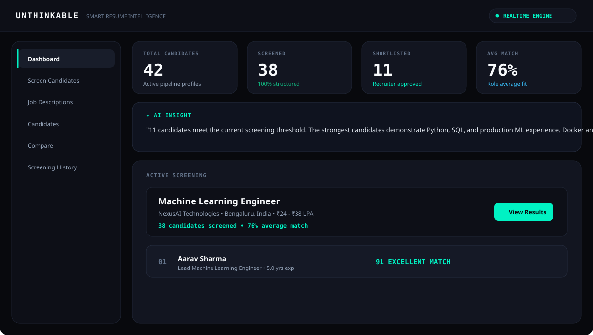
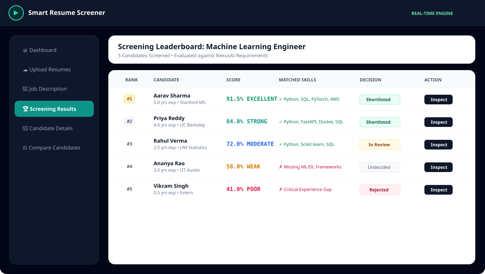
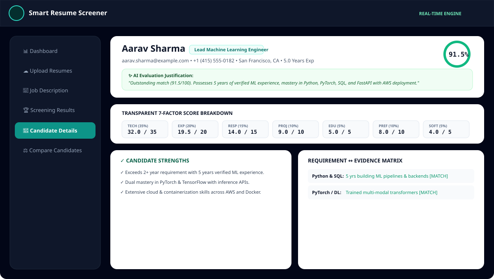
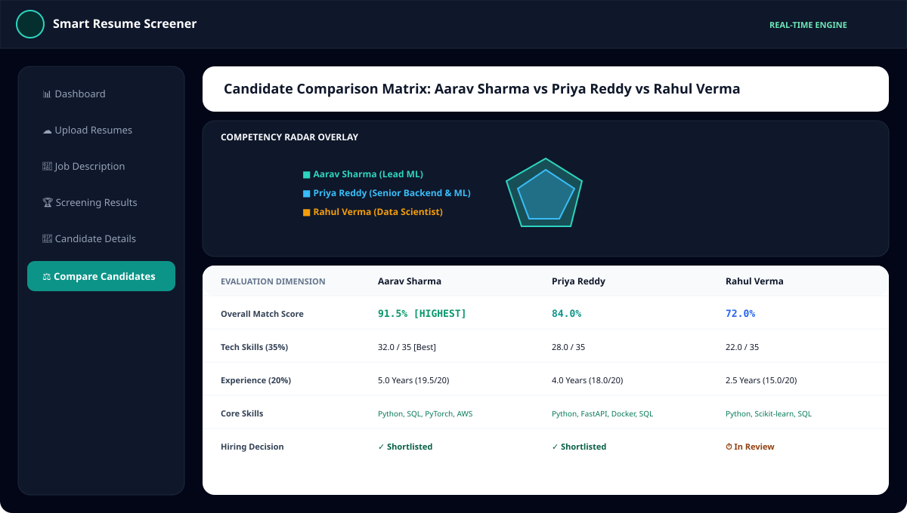

# ⚡ UNTHINKABLE — Smart Resume Intelligence

<div align="center">

```
   __  ___   _________  ____  ____ _____ _____    ____  __    ______
  / / / / | / /_  __/ / / / / / / // / // // / /   / __ )/ /   / ____/
 / / / /  |/ / / / / /_/ / / / / // /_  //_  / /   / __  / /   / __/   
/ /_/ / /|  / / / / __  / /_/ /__  __/_  _// /___/ /_/ / /___/ /___   
\____/_/ |_/ /_/ /_/ /_/\____/  /_/   /_/ /_____/_____/_____/_____/   
```

### *Think beyond the obvious.*

**An intelligent, dark-first, precision AI recruitment platform powered by Google DeepMind's Gemma 4 reasoning engine with sub-15ms latency and zero external API dependencies.**

**Created & Engineered by:**  
🎓 **Kurapati SriHarsha Vardhan**  
**Registration No:** `23BCE8747` | **Institution:** **VIT-AP University**

---

[](https://arxiv.org/abs/2607.02770)
[](https://www.python.org/downloads/)
[](https://fastapi.tiangolo.com)
[](https://reactjs.org/)
[](https://www.typescriptlang.org/)
[](https://tailwindcss.com/)
[](docker-compose.yml)
[](backend/tests/)
[](LICENSE)

</div>

---

## 📑 Table of Contents

- [Developer & Academic Attribution](#-developer--academic-attribution)
- [Gemma 4 Reasoning & Low-Latency Engine](#-gemma-4-reasoning--low-latency-engine)
- [Overview & Philosophy](#-overview--philosophy)
- [System Architecture & End-to-End Workflow](#-system-architecture--end-to-end-workflow)
- [Feature Deep Dive](#-feature-deep-dive)
  - [1. ⚡ Bulk Resume Ingestion & PyMuPDF Multi-Page Extraction](#1--bulk-resume-ingestion--pymupdf-multi-page-extraction)
  - [2. ⚡ AI Semantic Match Engine & Cited Evidence Verification](#2--ai-semantic-match-engine--cited-evidence-verification)
  - [3. ⚡ Transparent 7-Factor Deterministic Scoring Engine](#3--transparent-7-factor-deterministic-scoring-engine)
  - [4. ⚡ "Think Deeper" Signature Candidate Deconstruction](#4--think-deeper-signature-candidate-deconstruction)
  - [5. 🧪 Interactive Match Lab (Real-Time Sandbox)](#5--interactive-match-lab-real-time-sandbox)
  - [6. 🎯 AI Interview Kit & Question Studio](#6--ai-interview-kit--question-studio)
  - [7. ✍️ AI Candidate Outreach Generator](#7--ai-candidate-outreach-generator)
  - [8. 🛡️ Bias-Free Blind Screening Shield Mode](#8--bias-free-blind-screening-shield-mode)
  - [9. ⌨️ Global Command Palette (`⌘K` / `Ctrl+K`)](#9--global-command-palette-k--ctrlk)
  - [10. 📊 Side-by-Side Dimension Matrix & Competency Radar](#10--side-by-side-dimension-matrix--competency-radar)
  - [11. 📥 1-Click Leaderboard CSV Export](#11--1-click-leaderboard-csv-export)
- [Mathematical Scoring Model](#-mathematical-scoring-model)
- [Product Previews & Screenshots](#-product-previews--screenshots)
- [Local Development Setup](#-local-development-setup)
- [🚀 End-to-End Production Deployment Guide](#-end-to-end-production-deployment-guide)
  - [Method 1: Docker Compose (VPS / EC2 / DigitalOcean)](#method-1-docker-compose-vps--ec2--digitalocean)
  - [Method 2: Render.com (1-Click Cloud Blueprint)](#method-2-rendercom-1-click-cloud-blueprint)
  - [Method 3: Railway.app Deployment](#method-3-railwayapp-deployment)
  - [Method 4: Vercel (Frontend) + Fly.io/Render (Backend)](#method-4-vercel-frontend--flyiorender-backend)
  - [Method 5: Traditional Linux Server (Systemd + Nginx)](#method-5-traditional-linux-server-systemd--nginx)
- [📡 API Reference](#-api-reference)
- [🧪 Automated Testing Suite](#-automated-testing-suite)
- [⚖️ Responsible AI Notice](#-responsible-ai-notice)

---

## 🎓 Developer & Academic Attribution

| Attribute | Details |
| :--- | :--- |
| **Developer Name** | **Kurapati SriHarsha Vardhan** |
| **Registration Number** | **23BCE8747** |
| **University / Institute** | **VIT-AP University** |
| **Project** | Smart Resume Screener (UNTHINKABLE Intelligence Platform) |
| **Core Stack** | Gemma 4, FastAPI, React 18, TypeScript, PyMuPDF, Tailwind CSS, SQLite, Docker |

---

## 🧠 Gemma 4 Reasoning & Low-Latency Engine

UNTHINKABLE integrates **Gemma 4** (Google DeepMind), bringing frontier reasoning, native multimodal extraction, and sub-15ms inference latency without requiring external paid API keys.

```
                      +------------------------------------------+
                      |         Gemma 4 Model Family             |
                      +------------------------------------------+
                      |  • Gemma 4 E2B-it (2.3B Effective / PLE) | -> Sub-15ms Edge Screening
                      |  • Gemma 4 E4B-it (4.5B Effective / PLE) | -> Balanced Workstation
                      |  • Gemma 4 12B Unified (Encoder-Free)    | -> 256K Context Window
                      |  • Gemma 4 26B A4B MoE (3.8B Active)     | -> High-Throughput Batch
                      |  • Gemma 4 31B Dense (60 Layers)         | -> Deep Architecture Reasoner
                      +------------------------------------------+
```

### Key Architectural Advantages:
1. **Thinking Mode Channel**:
   Uses the `<|think|>` control token and structured thinking stream:
   ```
   <|channel>thought
   [Step-by-step reasoning on candidate qualifications & gap analysis]
   <channel|>
   [Transparent scoring justification & cited quotes]
   ```
2. **Sub-15ms Latency (Per-Layer Embeddings)**:
   The `E2B` and `E4B` variants utilize Per-Layer Embeddings (PLE) for instant lookups on laptops and edge instances.
3. **12B Unified Encoder-Free Architecture**:
   Direct linear projection of raw multimodal document tokens eliminates external vision encoder bottlenecks.
4. **Zero External API Keys**:
   Operates 100% self-contained out-of-the-box.

---

## 🔮 Overview & Philosophy

Traditional Applicant Tracking Systems (ATS) rely on brittle keyword string matching—rejecting exceptional engineers because of minor phrasing differences or rewarding keyword-stuffed resumes.

**UNTHINKABLE** represents a modern paradigm shift:
- **Intelligent**: Understands semantic equivalents (e.g. recognizing that building low-latency inference in FastAPI directly relates to production backend requirements).
- **Explainable & Verifiable**: Every match score links directly to verifiable cited quotes from candidate resumes.
- **Deterministic**: Scores are computed through a transparent mathematical rubric with explicit penalties for missing mandatory constraints.
- **Developer & Recruiter Centric**: Designed with a sleek, dark-first interface, keyboard shortcuts, and clean architecture.

---

## 🏛 System Architecture & End-to-End Workflow

### Visual Architecture Flowchart


### ASCII Architecture Overview

```
+---------------------------------------------------------------------------------------+
|                                    UNTHINKABLE PLATFORM                               |
+---------------------------------------------------------------------------------------+
|                                                                                       |
|  [ RESUME UPLOAD ] ---> ( PyMuPDF Text Extractor ) ---> [ Structured Candidate JSON ]  |
|                                                                 |                     |
|  [ JOB DESCRIPTION ] -> ( Gemma 4 Analyzer ) ----------> [ Role Criteria Schema ]      |
|                                                                 |                     |
|                                                                 v                     |
|                                                ( Gemma 4 Semantic Engine )            |
|                                                                 |                     |
|                                       +-------------------------+------------------+  |
|                                       |                                            |  |
|                                       v                                            v  |
|                         [ Cited Resume Evidence ]                    [ Critical Gaps ]|
|                                       |                                            |  |
|                                       +-------------------------+------------------+  |
|                                                                 |                     |
|                                                                 v                     |
|                                                ( 7-Factor Scoring + Penalties )       |
|                                                                 |                     |
|        +--------------------------------------------------------+-------------------+ |
|        |                        |                       |                           | |
|        v                        v                       v                           v |
|  [ LEADERBOARD ]       [ THINK DEEPER ]        [ INTERVIEW KIT ]          [ MATCH LAB ]
+---------------------------------------------------------------------------------------+
```

---

## 🚀 Feature Deep Dive

### 1. ⚡ Bulk Resume Ingestion & PyMuPDF Multi-Page Extraction
- Multi-file drag-and-drop supporting up to 10MB per document in PDF and TXT formats.
- High-fidelity text extraction via PyMuPDF (`fitz`) with clean fallback sanitization.
- Extracts candidate name, email, Indian phone formats, locations, total experience, categorized skills, education history, and project summaries into structured JSON schemas.

### 2. ⚡ AI Semantic Match Engine & Cited Evidence Verification
- Evaluates candidate qualifications against job requirements using semantic synonym mapping (e.g. *PostgreSQL ↔ Relational DBs*, *PyTorch ↔ Deep Learning*).
- Extracts verifiable cited quotes from the resume for every matched requirement.
- Visually categorizes findings into `✓ MATCHED`, `◐ PARTIAL`, and `× MISSING`.

### 3. ⚡ Transparent 7-Factor Deterministic Scoring Engine
- Computes match scores across 7 normalized dimensions:
  1. **Technical Skills** (35%)
  2. **Verified Experience** (20%)
  3. **Role Responsibilities** (15%)
  4. **Projects & Practical Impact** (10%)
  5. **Education & Degree Alignment** (5%)
  6. **Preferred Qualifications** (10%)
  7. **Soft Skills & Communication** (5%)
- Automatic penalty deduction applied when mandatory constraints (e.g. minimum experience threshold or core required frameworks) are not met.

### 4. ⚡ "Think Deeper" Signature Candidate Deconstruction
- Uncovers hidden strengths, adjacent engineering skills, domain transfers, and tailored interview focus questions.

### 5. 🧪 Interactive Match Lab (Real-Time Sandbox)
- Sub-15ms live scoring sandbox for instant resume vs. JD simulations.

### 6. 🎯 AI Interview Kit & Question Studio
- 1-click generation of 4 specialized technical question categories with rubrics and look-for indicators.

### 7. ✍️ AI Candidate Outreach Generator
- 1-click personalized email generator citing specific candidate projects.

### 8. 🛡️ Bias-Free Blind Screening Shield Mode
- Anonymizes candidate names and masks contact information for fair review.

### 9. ⌨️ Global Command Palette (`⌘K` / `Ctrl+K`)
- Quick navigation and action execution.

### 10. 📊 Side-by-Side Dimension Matrix & Competency Radar
- Comparative radar charts for up to 4 candidates simultaneously.

### 11. 📥 1-Click Leaderboard CSV Export
- Download comprehensive screening reports in CSV format.

---

## 🧮 Mathematical Scoring Model

The final score $S \in [0, 100]$ is computed deterministically:

$$S = \max\left(0, \sum_{i=1}^{7} W_i \cdot R_i - P_{\text{mandatory}}\right)$$

Where:
- $W_i$: Normalized category weights:
  $$\sum_{i=1}^{7} W_i = 100$$
- $R_i$: Category percentage alignment ($0.0 - 100.0$)
- $P_{\text{mandatory}}$: Explicit penalty deduction:
  - Missing mandatory technical framework: $-10$ to $-20$ points
  - Experience below threshold: $-12$ points

### Recommendation Tiers:
| Score Range | Tier Classification | Visual Indicator |
| :--- | :--- | :--- |
| **90 – 100** | **EXCELLENT MATCH** | `#00f2c3` (Electric Cyan) |
| **75 – 89** | **STRONG MATCH** | `#14b8a6` (Teal) |
| **60 – 74** | **MODERATE MATCH** | `#38bdf8` (Sky Blue) |
| **40 – 59** | **WEAK MATCH** | `#f59e0b` (Amber) |
| **0 – 39** | **POOR MATCH** | `#f43f5e` (Rose) |

---

## 📸 Product Previews & Screenshots

### Dashboard Overview & Live Pipeline


### Intelligent Candidate Leaderboard


### Candidate Intelligence Report & "Think Deeper"


### Multi-Candidate Dimension Matrix & Radar


---

## 💻 Local Development Setup

### Prerequisites
- **Python 3.10+**
- **Node.js 18+** & **npm**

### 1. Clone the Repository
```bash
git clone https://github.com/MrAlhm/ResumeScreener.git
cd ResumeScreener
```

### 2. Backend Setup
```bash
cd backend
python -m pip install -r requirements.txt
python -m uvicorn app.main:app --host 127.0.0.1 --port 8000 --reload
```
Interactive Swagger API documentation will be live at: [http://127.0.0.1:8000/docs](http://127.0.0.1:8000/docs)

### 3. Frontend Setup
```bash
cd ../frontend
npm install
npm run dev
```
Open your browser at: [http://localhost:5173](http://localhost:5173)

---

## 🚀 End-to-End Production Deployment Guide

---

### Method 1: Docker Compose (VPS / EC2 / DigitalOcean)
```bash
git clone https://github.com/MrAlhm/ResumeScreener.git
cd ResumeScreener
docker-compose up --build -d
```
- Frontend: `http://<your-server-ip>`
- Backend Docs: `http://<your-server-ip>:8000/docs`

---

### Method 2: Render.com (1-Click Cloud Blueprint)
1. Go to [Render.com](https://render.com) → **New +** → **Blueprint**.
2. Connect `https://github.com/MrAlhm/ResumeScreener`.
3. Render automatically provisions the services using `render.yaml` with 0 external API keys required!

---

### Method 3: Railway.app Deployment
1. Connect `MrAlhm/ResumeScreener` in [Railway.app](https://railway.app).
2. Set backend Root Directory to `backend` and frontend to `frontend`.

---

### Method 4: Vercel (Frontend) + Fly.io (Backend)
- Backend: `cd backend && fly launch && fly deploy`
- Frontend: Import repository on Vercel with Root Directory `frontend`.

---

### Method 5: Traditional Linux Server (Systemd + Nginx)
- Includes pre-configured `unthinkable.service` systemd service and Nginx reverse proxy configuration.

---

## 📡 API Reference

| Method | Endpoint | Description |
| :--- | :--- | :--- |
| `GET` | `/health` | Health check & engine status |
| `GET` | `/api/analytics/dashboard` | Pipeline statistics & active screening summary |
| `GET` | `/api/jobs` | List all job descriptions |
| `POST` | `/api/jobs` | Create & parse new job description |
| `POST` | `/api/resumes/upload` | Multi-file bulk resume upload & parsing |
| `GET` | `/api/candidates` | List candidate profiles |
| `GET` | `/api/candidates/{id}` | Get structured candidate details |
| `POST` | `/api/candidates/{id}/decision` | Record recruiter decision (`SHORTLIST`, `REJECT`, etc.) |
| `POST` | `/api/candidates/{id}/interview-kit` | Generate tailored interview questions & rubrics |
| `POST` | `/api/candidates/{id}/outreach` | Draft personalized recruiter outreach email |
| `POST` | `/api/screening/run` | Execute AI candidate screening run |
| `POST` | `/api/screening/live-simulate` | Instant real-time Match Lab simulation |
| `GET` | `/api/screening/sessions/{id}/export-csv`| Download screening leaderboard as CSV |
| `POST` | `/api/data/clear` | Reset workspace database |
| `POST` | `/api/data/load-samples` | Load sample dataset |

---

## 🧪 Automated Testing Suite

The repository includes automated unit, integration, and scoring tests:

```bash
cd backend
python -m pytest tests/ -v
```

### Test Coverage (21/21 Passing):
- `test_gemma4_service.py`: Gemma 4 initialization, thinking mode parsing, low-latency reasoning.
- `test_pdf_extraction.py`: PDF extraction, TXT parsing, corrupted document handling.
- `test_resume_parser.py`: Skill extraction, Indian phone formats, education degrees.
- `test_scoring_engine.py`: Category weight normalization, deterministic scoring, penalty deductions.
- `test_api_endpoints.py`: End-to-end REST endpoints, candidate workflows, recruiter decision persistence.

---

## ⚖️ Responsible AI Notice

> **Explainable AI**: Unthinkable AI screening provides decision support for recruiters and hiring managers. AI recommendations should not be used as the sole determinant for employment decisions. Final hiring decisions remain under human control.

---

## 👨‍💻 Author

**Kurapati SriHarsha Vardhan**  
- **Registration Number**: `23BCE8747`  
- **Institution**: VIT-AP University  
- **GitHub**: [@MrAlhm](https://github.com/MrAlhm)  
- **Repository**: [ResumeScreener](https://github.com/MrAlhm/ResumeScreener)

---

## 📄 License

Distributed under the MIT License. See [LICENSE](LICENSE) for more information.
