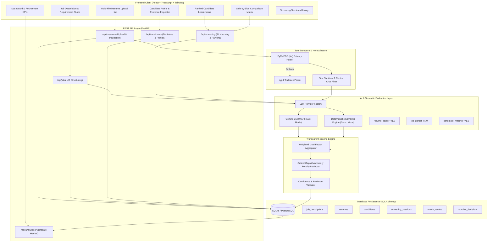

# Architecture Documentation: Smart Resume Screener

## 1. Architectural Overview

**Smart Resume Screener** is an enterprise-grade AI recruitment platform engineered with a strict separation of concerns between **Text Extraction**, **Document Structuring**, **Job Requirement Parsing**, **Semantic Evaluation**, **Multi-Factor Scoring**, and **Decision Management**.



---

## 2. Core Processing Pipeline

```
[Resume PDF/TXT]
      ↓
(1) PyMuPDF Extraction & Section Normalization
      ↓
(2) LLM Resume Structuring (resume_parser_v1.0)
      ↓
[Structured Candidate Profile JSON]
      ↓
[Job Description Text] → (3) LLM JD Analysis (job_parser_v1.0) → [Structured Job JSON]
      ↓                                                                 ↓
      └─────────────────────────┬───────────────────────────────────────┘
                                ↓
                 (4) Semantic Candidate ↔ Job Matching
                                ↓
                 (5) Multi-Factor Score Calculation
                     - Technical Skills: 35%
                     - Experience: 20%
                     - Responsibilities: 15%
                     - Projects: 10%
                     - Education: 5%
                     - Preferred Skills: 10%
                     - Soft Skills: 5%
                                ↓
                 (6) Mandatory Requirement Penalty Deductions
                                ↓
                 (7) Recommendation Classification
                     (90-100: Excellent, 75-89: Strong, 60-74: Moderate, 40-59: Weak, 0-39: Poor)
                                ↓
                 (8) Persistent Ranked Session & Recruiter Decisions
```

---

## 3. Component Responsibilities

### 3.1. Frontend (`frontend/`)
- **React 18 + TypeScript + Vite + Tailwind CSS**: Single Page Application designed as an enterprise recruitment portal.
- **`DashboardPage`**: Displays active screening overview, KPI cards (Total Candidates, Processed, Shortlisted, Average Match Score), top candidate spotlight, and recent sessions.
- **`UploadPage`**: Drag & drop zone supporting multi-file PDF/TXT batch uploads with progress tracking and modal inspect.
- **`JobDescriptionPage`**: Job studio with prebuilt role templates (ML Engineer, Full Stack, Data Engineer) and real-time structured requirements preview.
- **`ScreeningResultsPage`**: Interactive leaderboard with circular score gauges, matched/missing skill chips, min-score sliders, recommendation tier filters, and recruiter decision toggles.
- **`CandidateDetailPage`**: Deep-dive profile inspector with multi-factor breakdown cards, strengths, critical gaps, evidence quotes, and hiring notes.
- **`CompareCandidatesPage`**: Side-by-side comparison table with category winner badges and competency radar chart.
- **`ScreeningHistoryPage`**: Chronological audit trail of past screening runs.

### 3.2. Backend (`backend/app/`)
- **FastAPI Core**: Async REST API endpoints with Pydantic v2 schemas and centralized exception handling.
- **PDF Extraction Engine (`app/parsers/pdf_extractor.py`)**: Multi-page text extraction using `PyMuPDF` with fallback to `pypdf`, text sanitization, and scanned PDF detection.
- **LLM Abstraction (`app/llm/`)**: Factory pattern delivering `GeminiLLMService` (live Google Gemini API) or `DemoLLMService` (offline high-fidelity rule-based engine) based on environment configuration.
- **Scoring Engine (`app/scoring/`)**: Transparent deterministic mathematical scoring with configurable category weights and penalty logic for missing mandatory criteria.
- **Database Layer (`app/database/`, `app/models/`)**: SQLAlchemy ORM persisting candidates, resumes, structured JSON payloads, sessions, match results, and recruiter decisions.

---

## 4. LLM Cost & Performance Optimization

1. **One-Time Resume Parsing**: Resumes are parsed once upon upload and structured into schema-validated JSON. Subsequent screenings reuse the stored structured profile rather than re-tokenizing raw resume text.
2. **One-Time Job Analysis**: Job descriptions are analyzed once and structured into mandatory vs. preferred requirements.
3. **Optimized Match Payload**: The semantic matcher receives only structured JSON candidate profiles and structured job requirements, keeping token consumption minimal and deterministic.

---

## 5. Security & Responsible AI

- **File Validation**: Strict file type validation (`.pdf`, `.txt`), maximum file size limits (10MB default), and sanitization of null bytes and control characters.
- **Fairness & Bias Prevention**: Evaluation prompts and scoring logic operate exclusively on job-relevant technical skills, experience depth, verified projects, and education. Demographics, gender, age, and personal attributes are excluded from scoring.
- **Decision Independence**: AI recommendation labels (`EXCELLENT`, `STRONG`, `MODERATE`, `WEAK`, `POOR`) and Recruiter decisions (`SHORTLISTED`, `REJECTED`, `REVIEW`) are stored separately, ensuring AI serves as an advisory co-pilot.
